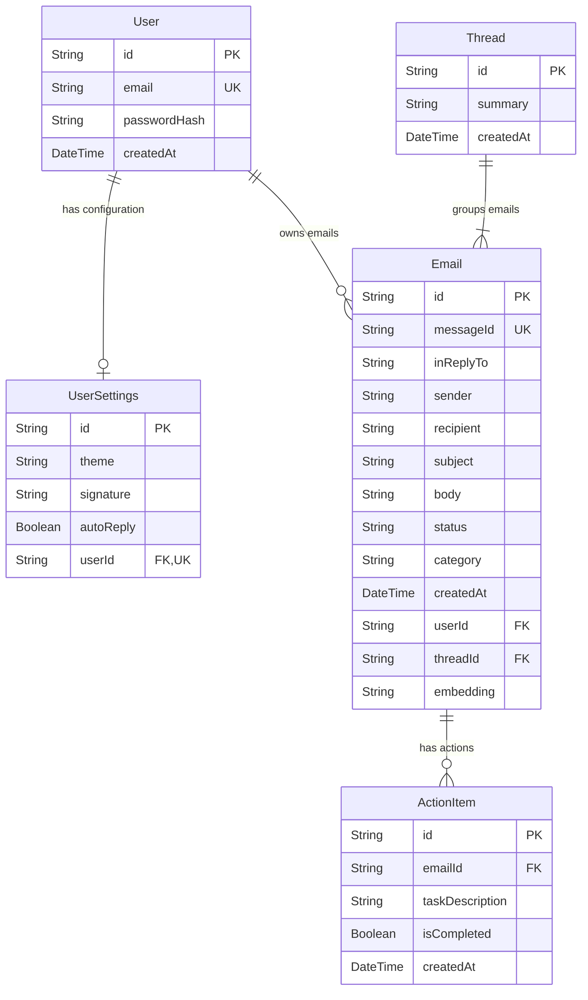

# 🗄️ InboxOS Database Schema Documentation

This document describes the database models, tables, columns, and relationships defined in the Prisma schema file [schema.prisma](../../backend/prisma/schema.prisma).

---

## 📊 Entity Relationship Diagram (ERD)

The following Mermaid diagram visualizes the database models and how they relate to one another:

---

## 🗂️ Data Models

### 1. User
Stores registered user credentials and administrative metadata.

| Column | Type | Nullable? | Description |
| :--- | :--- | :---: | :--- |
| `id` | `String` (UUID) | ❌ No | **Primary Key**. Unique identifier generated automatically via UUID. |
| `email` | `String` | ❌ No | **Unique**. The user's primary email address used for login. |
| `passwordHash` | `String` | ❌ No | BCrypt hashed password for authentication security. |
| `createdAt` | `DateTime` | ❌ No | Timestamp of account registration. Defaults to current timestamp. |

---

### 2. UserSettings
Contains user-specific interface preferences and automation parameters.

| Column | Type | Nullable? | Description |
| :--- | :--- | :---: | :--- |
| `id` | `String` (UUID) | ❌ No | **Primary Key**. Unique identifier for the settings record. |
| `theme` | `String` | ❌ No | Dashboard interface theme option. Defaults to `"dark"`. |
| `signature` | `String` |  Yes | Email signature appended to outbound messages/replies. |
| `autoReply` | `Boolean` | ❌ No | Toggles automated AI email reply workflows. Defaults to `false`. |
| `userId` | `String` (UUID) | ❌ No | **Foreign Key** / **Unique**. References the associated `User`. |

---

### 3. Thread
Groups individual emails that share the same message history or reply-chain.

| Column | Type | Nullable? | Description |
| :--- | :--- | :---: | :--- |
| `id` | `String` (UUID) | ❌ No | **Primary Key**. Unique identifier for the email thread. |
| `summary` | `String` |  Yes | High-level summary of the entire thread generated by AI. |
| `createdAt` | `DateTime` | ❌ No | Timestamp when the thread was first initiated. Defaults to current timestamp. |

---

### 4. Email
Stores parsed content, sender details, categories, and priority metrics for each email.

| Column | Type | Nullable? | Description |
| :--- | :--- | :---: | :--- |
| `id` | `String` (UUID) | ❌ No | **Primary Key**. Unique identifier for the email record. |
| `messageId` | `String` | ❌ No | **Unique**. Original email ID header (e.g. SMTP Message-ID) to prevent duplicate parsing. |
| `inReplyTo` | `String` |  Yes | References the parent email `messageId` if the email is a reply. |
| `sender` | `String` | ❌ No | Email address of the message sender. |
| `recipient` | `String` | ❌ No | Email address of the message recipient. |
| `subject` | `String` | ❌ No | Subject line of the email. |
| `body` | `String` | ❌ No | Parsed clean Markdown/plain-text content of the email body. |
| `status` | `String` | ❌ No | Processing/read status (`UNREAD`, `READ`, `ARCHIVED`). Defaults to `UNREAD`. |
| `category` | `String` |  Yes | AI-classified category (e.g. `academic`, `finance`, `meeting`, `OTP`, etc.). |
| `createdAt` | `DateTime` | ❌ No | Timestamp when the email was parsed/received. Defaults to current timestamp. |
| `userId` | `String` (UUID) | ❌ No | **Foreign Key**. References the `User` owner. |
| `threadId` | `String` (UUID) | ❌ No | **Foreign Key**. References the parent `Thread` container. |
| `embedding` | `String` |  Yes | Vector embeddings generated from the email body text for semantic searches. |

---

### 5. ActionItem
Represents parsed task items extracted from received emails by the AI model.

| Column | Type | Nullable? | Description |
| :--- | :--- | :---: | :--- |
| `id` | `String` (UUID) | ❌ No | **Primary Key**. Unique identifier for the action item task card. |
| `emailId` | `String` (UUID) | ❌ No | **Foreign Key**. References the parent `Email` source document. |
| `taskDescription` | `String` | ❌ No | Text description of the task to be completed. |
| `isCompleted` | `Boolean` | ❌ No | Toggle flag for task completion status. Defaults to `false`. |
| `createdAt` | `DateTime` | ❌ No | Timestamp when the action item was generated. Defaults to current timestamp. |

---

## 🔗 Model Relationships & Cascading Rules

| Relationship | Type | Foreign Key | Cascade Rule | Description |
| :--- | :--- | :--- | :--- | :--- |
| **User** ↔ **UserSettings** | `One-to-One` | `UserSettings.userId` | `onDelete: Cascade` | Deleting a `User` automatically deletes their corresponding `UserSettings` configurations. |
| **User** ↔ **Email** | `One-to-Many` | `Email.userId` | `onDelete: Cascade` | All emails owned by a user are permanently deleted if the parent `User` is deleted. |
| **Thread** ↔ **Email** | `One-to-Many` | `Email.threadId` | `onDelete: Cascade` | An `Email` belongs to exactly one `Thread`. If the parent thread is deleted, all emails in the thread are deleted. |
| **Email** ↔ **ActionItem** | `One-to-Many` | `ActionItem.emailId` | `onDelete: Cascade` | If an `Email` is deleted, any structured `ActionItem` generated from it will be automatically removed. |
