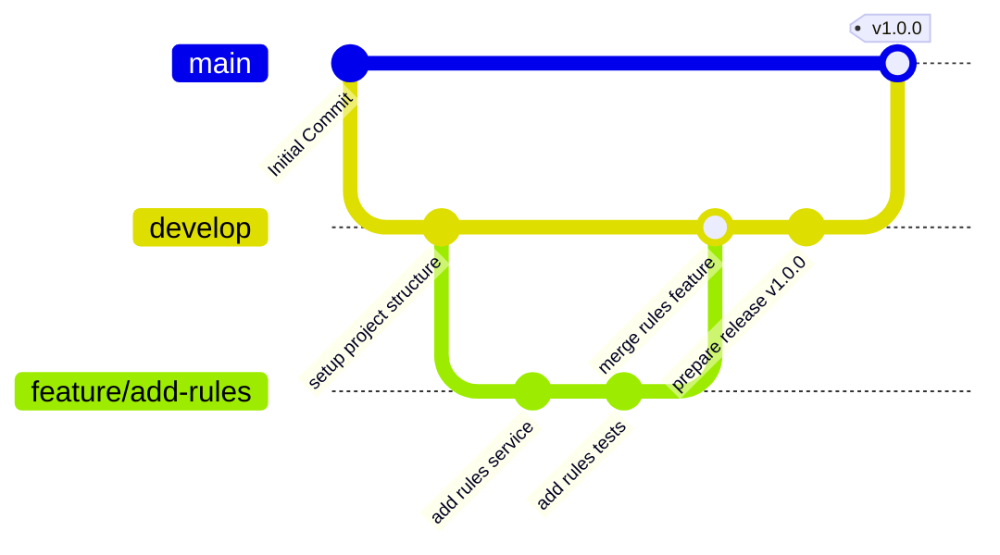

# 🌿 InboxOS Git Branching & Workflow

This document visualizes and describes the branching strategy used in **InboxOS**. We use a Git Flow-inspired model to manage features, releases, and bug fixes cleanly.

---

## 📊 Workflow Diagram

The diagram below illustrates how code flows from feature branches to `develop`, and eventually into the stable `main` branch with tags.



---

## 🌲 Branch Roles

### 1. `main` Branch (Production-Ready)
* **Purpose:** Production environment state.
* **Stability:** Extremely stable. Direct commits are forbidden.
* **Releases:** Code is merged into `main` from `develop` only during a release window, and must be tagged with a semantic version (e.g., `v1.0.0`).

### 2. `develop` Branch (Integration)
* **Purpose:** Integration branch for upcoming features.
* **Stability:** Relatively stable. It contains all merged and tested features waiting for the next release.
* **Workflow:** All feature branches (`feature/*`) must target and merge into `develop` via Pull Requests.

### 3. `feature/` Branches (Active Development)
* **Purpose:** Isolation branch for developing a new feature or fixing a bug.
* **Naming Convention:** `feature/issue-[issue-number]-[short-description]` (e.g., `feature/issue-45-add-ollama`).
* **Lifetime:** Short-lived. Merged into `develop` as soon as the feature is complete, linted, and all test suites pass.

---

## 🔄 Lifecycle of a Feature

```
  [feature/*] ───────────────┐
                              ▼
  [develop] ─────────────────● Merge PR (Code review & tests pass)
                              │
                              ▼ (Release window)
  [main] ─────────────────────★ Tag Release (v1.0.0)
```

1. **Start Feature:** Create a new branch off of `develop`:
   ```bash
   git checkout develop
   git pull origin develop
   git checkout -b feature/issue-123-my-awesome-feature
   ```
2. **Commit Changes:** Work on your code locally, following the commit guidelines in our [CONTRIBUTING.md](../contributing/CONTRIBUTING.md).
3. **Submit Pull Request (PR):** Target the `develop` branch on the upstream repository.
4. **Code Review & Tests:** Maintainers will review the PR, and CI tests will run. Address any feedback on your branch.
5. **Merge PR:** A maintainer will squash-merge your PR into the `develop` branch.
6. **Release Tagging:** Once `develop` accumulates enough changes, a maintainer will merge `develop` into `main` and tag the release.
